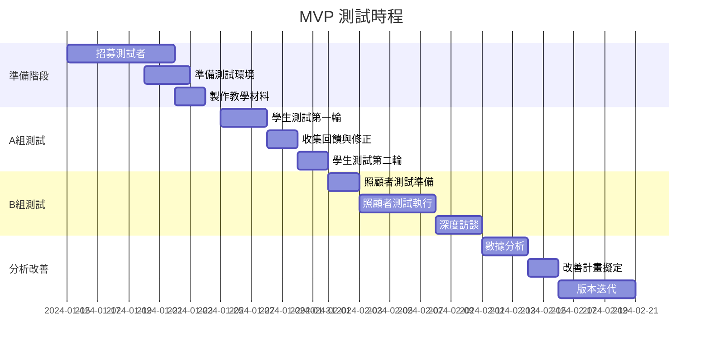

# MVP 測試計畫 v1.0

## 📋 概述

本計畫旨在驗證階段四優化後的 LINE Bot 系統，確保系統穩定性與使用者體驗達到預期目標。

## 🎯 測試目標

- **穩定性驗證**：確保系統在各種情況下穩定運行
- **使用者體驗評估**：收集真實使用者的回饋
- **功能完整性檢查**：驗證 M1-M4 模組整合效果
- **錯誤處理測試**：驗證錯誤處理機制的有效性

## 👥 測試使用者招募計畫

### A 組：學生測試者（快速迭代）
- **人數**：5-10 人
- **條件**：
  - 對 AI/Chatbot 有基本認識
  - 願意提供詳細回饋
  - 可配合多次測試
- **招募管道**：
  - 系上公告
  - 社群媒體
  - 同學推薦
- **測試重點**：
  - 功能完整性
  - 操作流暢度
  - 錯誤處理

### B 組：家庭照顧者（真實驗證）
- **人數**：3-5 人
- **條件**：
  - 實際照顧失智症家人
  - 年齡 40-70 歲
  - 會使用 LINE
- **招募管道**：
  - 失智症協會
  - 照顧者支持團體
  - 醫院社工轉介
- **測試重點**：
  - 實用性評估
  - 專業度認可
  - 實際應用價值

### C 組：照護專業人員（專業意見）
- **人數**：2-3 人
- **條件**：
  - 護理師/社工/職能治療師
  - 失智症照護經驗 2 年以上
- **招募管道**：
  - 專業社群
  - 醫療院所合作
- **測試重點**：
  - 專業準確性
  - 醫學建議品質
  - 安全性評估

## 📝 測試腳本設計

### 開場說明（5 分鐘）

1. **感謝參與**
   - 說明測試目的和重要性
   - 強調回饋的價值

2. **測試目的說明**
   - 驗證失智症照護 LINE Bot 功能
   - 收集使用者體驗回饋
   - 改善系統設計

3. **隱私權說明**
   - 所有資料僅用於系統改善
   - 不會洩露個人資訊
   - 可隨時退出測試

4. **操作簡介**
   - 基本操作方式
   - 測試流程說明
   - 回饋提供方式

### 任務測試（20 分鐘）

#### 任務一：症狀諮詢
**場景**：「假設您的家人最近記憶力明顯退步...」

**操作步驟**：
1. 開啟 Line Bot
2. 輸入症狀描述：「媽媽常忘記關瓦斯」
3. 查看 AI 分析結果
4. 點擊查看視覺化解釋

**觀察重點**：
- [ ] 能否順利輸入問題
- [ ] 理解 AI 回應內容
- [ ] 視覺化解釋是否有幫助
- [ ] 整體操作流暢度

#### 任務二：模組切換
**場景**：「AI 建議您查看不同階段的照護重點...」

**操作步驟**：
1. 從 M1 警訊跳轉到 M2
2. 瀏覽病程資訊
3. 返回主選單

**觀察重點**：
- [ ] 模組切換是否順暢
- [ ] 資訊架構是否清晰
- [ ] 能否找到返回路徑

#### 任務三：錯誤處理
**場景**：「嘗試一些系統可能無法理解的輸入...」

**操作步驟**：
1. 輸入模糊描述：「頭痛」
2. 體驗錯誤處理
3. 使用快速選項

**觀察重點**：
- [ ] 錯誤訊息是否友善
- [ ] 能否從錯誤中恢復
- [ ] 替代方案是否有用

### 深度訪談（15 分鐘）

#### 整體使用感受
- 整體印象如何？
- 最喜歡的功能是什麼？
- 最不滿意的地方？

#### 最有幫助的功能
- 哪個功能最有幫助？
- 為什麼覺得有幫助？
- 希望如何改善？

#### 最困惑的地方
- 哪個部分最難理解？
- 操作上有什麼困難？
- 建議如何改善？

#### 改善建議
- 希望新增什麼功能？
- 介面設計如何改善？
- 回應速度是否滿意？

#### 實際使用意願
- 會推薦給其他人嗎？
- 願意實際使用嗎？
- 願意付費使用嗎？

## 📊 回饋收集工具

### 線上問卷結構

```javascript
const feedbackSurvey = {
  sections: [
    {
      title: "基本資料",
      questions: [
        { 
          id: "age_group", 
          type: "select", 
          options: ["20-29", "30-39", "40-49", "50-59", "60+"] 
        },
        { 
          id: "caregiving_experience", 
          type: "radio", 
          options: ["是", "否"] 
        },
        { 
          id: "tech_comfort", 
          type: "scale", 
          min: 1, 
          max: 5, 
          labels: ["很不熟悉", "很熟悉"] 
        }
      ]
    },
    {
      title: "功能評估",
      questions: [
        { 
          id: "ai_accuracy", 
          type: "scale", 
          min: 1, 
          max: 5,
          label: "AI 分析準確度"
        },
        { 
          id: "visual_helpfulness", 
          type: "scale", 
          min: 1, 
          max: 5,
          label: "視覺化解釋幫助程度"
        },
        { 
          id: "navigation_ease", 
          type: "scale", 
          min: 1, 
          max: 5,
          label: "操作便利性"
        },
        { 
          id: "error_handling", 
          type: "scale", 
          min: 1, 
          max: 5,
          label: "錯誤處理友善度"
        }
      ]
    },
    {
      title: "開放意見",
      questions: [
        { 
          id: "most_useful", 
          type: "text", 
          prompt: "哪個功能最有用？" 
        },
        { 
          id: "most_confusing", 
          type: "text", 
          prompt: "哪裡最需要改進？" 
        },
        { 
          id: "additional_features", 
          type: "text", 
          prompt: "希望新增什麼功能？" 
        }
      ]
    }
  ]
};
```

### 使用數據追蹤

```javascript
const analyticsTracking = {
  events: [
    "bot_started",
    "module_selected",
    "ai_response_received",
    "visual_explanation_viewed",
    "error_encountered",
    "feedback_submitted",
    "session_ended"
  ],
  metrics: [
    "session_duration",
    "messages_exchanged",
    "modules_used",
    "errors_encountered",
    "feedback_completion_rate"
  ]
};
```

## 📅 測試時程規劃



## 🎯 成功指標

### 完成率指標
- **測試完成率** > 80%
- **問卷填寫率** > 70%
- **深度訪談完成率** > 90%

### 滿意度指標
- **整體滿意度** > 4/5
- **功能實用性** > 4/5
- **操作便利性** > 4/5
- **錯誤處理滿意度** > 4/5

### 技術指標
- **重大錯誤** < 5%
- **系統穩定性** > 95%
- **回應時間** < 3 秒

### 商業指標
- **願意推薦** > 70%
- **實際使用意願** > 60%
- **付費意願** > 30%

## 📋 測試檢查清單

### 測試前準備
- [ ] 測試環境設置完成
- [ ] 測試腳本準備就緒
- [ ] 問卷系統建置完成
- [ ] 數據追蹤設定完成
- [ ] 測試者招募完成
- [ ] 教學材料準備完成

### 測試執行
- [ ] 開場說明完成
- [ ] 任務測試執行
- [ ] 深度訪談完成
- [ ] 問卷填寫完成
- [ ] 數據收集完成

### 測試後處理
- [ ] 數據分析完成
- [ ] 回饋整理完成
- [ ] 改善計畫擬定
- [ ] 版本迭代完成
- [ ] 測試報告撰寫

## 🔧 技術準備

### 測試環境
- 獨立的測試 LINE Bot 帳號
- 測試專用資料庫
- 監控工具設定
- 錯誤日誌系統

### 數據收集
- 使用者行為追蹤
- 錯誤日誌記錄
- 效能監控
- 回饋收集系統

### 安全措施
- 個人資料保護
- 測試資料隔離
- 隱私權保護
- 資料加密傳輸

## 📞 聯絡資訊

### 測試協調者
- **姓名**：[待填寫]
- **聯絡方式**：[待填寫]
- **緊急聯絡**：[待填寫]

### 技術支援
- **技術負責人**：[待填寫]
- **聯絡方式**：[待填寫]
- **支援時間**：[待填寫]

---

**版本**：v1.0  
**建立日期**：2024-01-15  
**最後更新**：2024-01-15  
**負責人**：[待填寫] 